# Talker/80

## A Modern Voice Synthesizer for the TRS-80 Model 1, Model 3, and Model 4 
### New Dimensions in Voice Synthesis for the Iconic "Trinity" Computer from 1977 

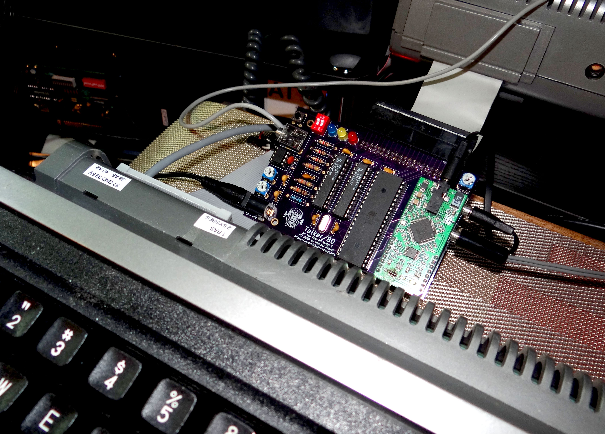

## News 

 - 5/5/2020: Talker/80 for the Model 1 is available!
 - 5/6/2020: The first three Talker/80's have been sold! 
 - 5/7/2020: [Hackster posted the Talker/80 story.](https://www.hackster.io/news/michael-wessel-s-talker-80-brings-back-the-classic-trs-80-voice-synthesizer-add-on-bfe66999ac29) 

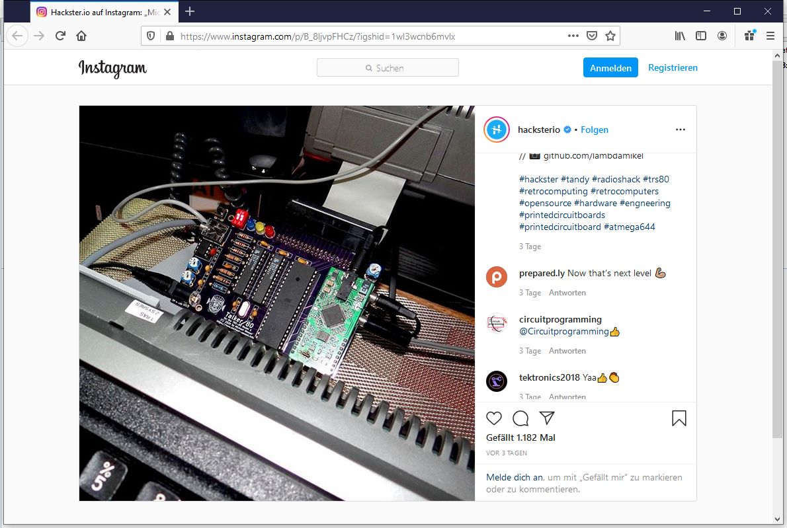

 - 5/8/2020: I am waiting for feedback from the first three customers before selling more. 
 - 5/11/2020: Three more Talker/80 have been assembled. I ran out of click speech boards. Need to reorder. 
 - 5/12/2020: Hackster's Instagram post shows 1.182 likes after 3 days :-) 
 - 5/12/2020: Confirmed that the TRS Voice Synthesizer Emulation Mode also works from the Expansion Interface expansion port edge connector (left front corner, left side edge connector of the EI). 
 - 5/14/2020: I was being asked in the Vintage Computer Forum about the availabilty of the Gerbers and the ATmega firmware. Currently, I am waiting to hear from the first three customers if there were any problems with theirs setups. If there are no major problems, I am going to make the Gerbers and firmware available soon, hopefully by the end of May. Stay tuned!
 - 5/21/2020: One of the first Talker/80 users has published a positive review on the [Vintage Computer Forum.](http://www.vcfed.org/forum/showthread.php?74036-Talker-80-New-Voice-Synthesizer-in-the-Making/page4) Review from **Alphasite:** 

>I've had my Talker/80 for a couple of days.
>
>My first impression is this is very nice board and the fact that it emulates multiple voice synthesizers for the Model I is amazing.
>
>My first test was to connect it to my Model I and Expansion Interface and use the HFE image provided in the Github page. I ran all the included tests successfully. I was very impressed.
>
>My next test was to connect the Talker/80 to the Model I directly and then connect a Quinnterface/FreHD to the Talker/80. For this the power on sequence is critical. You must power on the Talker/80 first, then the Q/F combo. I didn't wait long enough and the Talker/80 would hang. The power on sequence is mentioned in the documentation and I found that if I waited for the Talker/80 to finish with the startup message before powering on the Q/F I was able to boot. It may not be necessary to wait that long but I didn't test because it's only a matter of a couple of seconds.
>
>My latest test was to try the Talker/80 with the MIRE and MISE. First I connected the MIRE to the Model I and then the Talker/80. I had this all on a power switch and they powered on at the same time and there wasn't an issue. I had the Talking Eliza program loaded on my MIRE emulated floppy from testing a Radio Shack Voice Synthesizer so I set the dip switches on the Talker/80 to start up in RS VS mode and reset. I then ran Talking Eliza and it worked perfectly. I then powered everything off and connected the MISE to the expansion connector on the Talker/80 and powered everything up again. Again everything came up without any issues. The Talking Eliza program still worked.
>
>Did I mention that I am very impressed? 

 - 5/23/2020: Firmware sources and Gerbers added. 
 - 5/24/2020: Link to Seeed Gallery for PCB ordering added. Note that there is also the OshPark link - the OshPark PCBs have far superior quality (copper instead of tin!), but are also a bit more pricey. However, the higher quality might pay off especially considering the Talker/80 expansion port connector  passthrough. 
 - 5/24/2020: 6 Talker/80 have been sold by now - thanks a lot for supporting the project! 
 - 5/31/2020: 9 Talker/80 have been sold. MATRIXSYNTH.COM tweeted about Talker/80: 

 - 6/9/2020: The **Talker/80 Model 3 & Model 4** version has been designed and been sent to OshPark for PCB fabrication. 
 - 6/16/2020: Check out [**TRS-80 TrashTalk Episode 36**](https://www.trs80trashtalk.com/2020/06/episode-36.html) and **TrashTalker Eric Dittman's review of Talker/80!** Thanks to Eric and the TrashTalkers for supporting the project. 

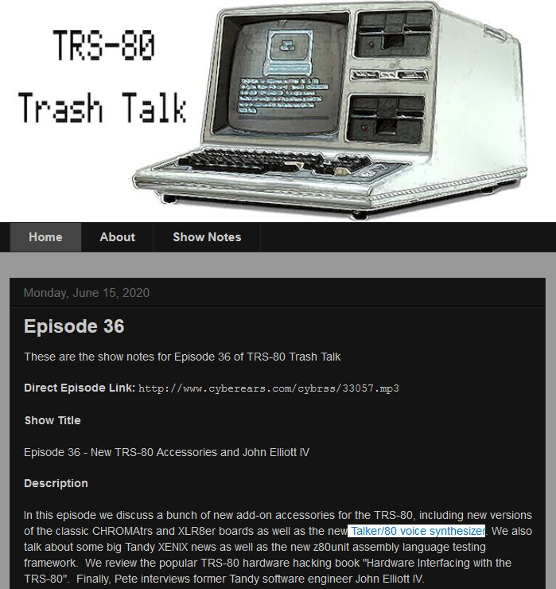

 - 7/3/2020: The first Talker/80 for the Model 3 / 4 has been assembled and tested! 

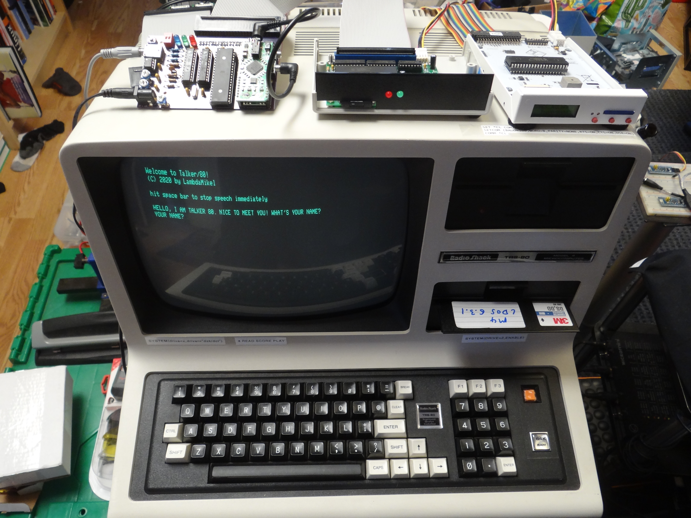

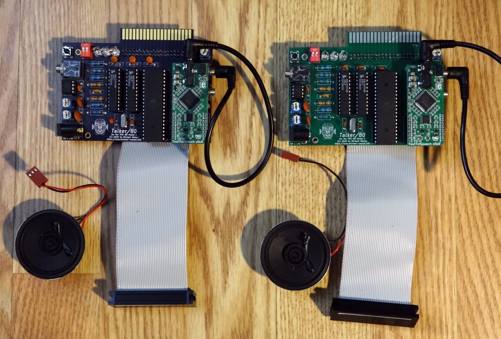

- 7/11/2020: 12 Talker/80 Model 1 have been sold! 
- 7/21/2020: The first batch of 3 Talker/80 for the Model 3 / 4 have been sold. 

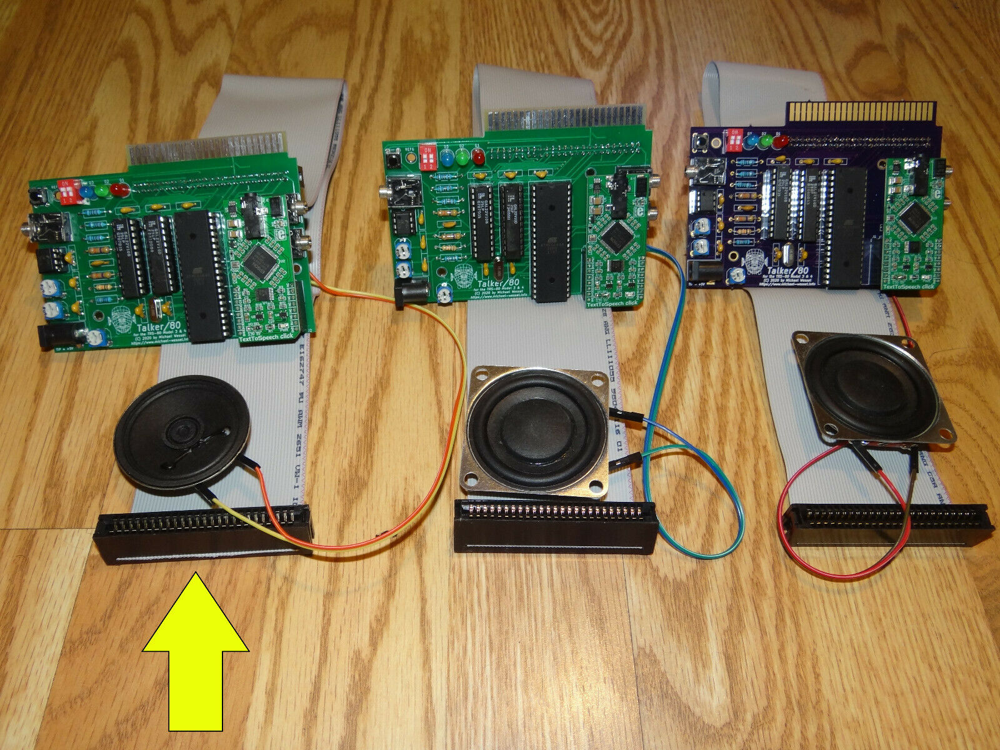

## Important License Information

Talker/80 uses GPL 3. This code uses the [Epson S1V30120 firmware image]( https://github.com/MikroElektronika/Click_TextToSpeech_S1V30120/blob/master/library/include/text_to_speech_img.h)
from the [TextToSpeech click board library from MikroElektronika released under GPL2.](
https://github.com/MikroElektronika/Click_TextToSpeech_S1V30120) 
By using this code, you are also bound to the [Epson license terms for the S1V30120 firmware.](https://global.epson.com/products_and_drivers/semicon/products/speech/voice/sla/s1v30120_init_data.html)  

## Requirements 

This project was developed using
[WinAVR.](http://winavr.sourceforge.net/) In addition, the [AVR
Programming Libraries](https://github.com/hexagon5un/AVR-Programming)
from Elliot Williams' book "Make: AVR Programming" are being used. 

## Introduction

Talker/80 offers: 

  1. **DECtalk-Based Text-to-Speech (TTS) Synthesis:** the **Epson S1V30120 TTS** chip on the utilized mikroBUS "TextToSpeech Click!" daughterboard from MikroElektronika implements DECtalk v5 - a natural sounding speech synthesizer for English and Spanish, with different voices. DECtalk can even sing. The **DECtalk mode** is very powerful and versatile, but the DECtalk control language can be difficult to program. Hence, a simplified control language for the S1V30120 is offered as well, the so-called **Epson mode**. DECtalk mode is used to implement **emulations of two classic TRS-80 Voice Synthesizers**: the official TRS Voice Synthesizer from Tandy Radio Shack (Model 1 only), and the VS-100 Voice Synthesizer from Alpha Products (Model 1, 3, and 4). Both use the **Votrax SC-01** as their underlying speech chip. Talker/80 emulates the SC-01 by means of DECtalk here. The DECtalk and Epson modes produce superior speech quality, and text-to-speech is performed by Talker/80 itself, i.e., no breaking down into phonemes is required. Text to be spoken can be sent directly to IO port 11, and the status of the speech synthesizer is checked by reading from port 11. 

  2. **TRS Voice Synthesizer Emulation - MODEL 1 VERSION ONLY**: the emulation in terms of DECtalk as just described is good enough to produce understandable speech, but it sounds different than the Votrax SC-01 chip. Original software such as the TRS Voice Synthesizer BASIC Demo Program, and "Talking Eliza" work out of the box, but note that the emulation is only 80% faithful or so. Also, original software written for the TRS Voice Synthesizer will only work on Talker/80 for the Model 1. The Model 3 / 4 version offers a workaround (see below), but requires manual software conversion.  

 3. **VS-100 Voice Synthesizer from Alpha Products Emulation**: another classic TRS-80 voice synthesizer. Also used the Votrax SC-01, but was / is not compatible with the TRS Voice Synthesizer. Talker/80 uses the same method of emulation (mapping to DECtalk phonemes). Same comments wrt. buffering etc. apply. Original software works without patches (e.g., VS48 and VS-100DEMO.BAS etc.). In addition, **pitch control is currently no supported**, so the speech will be monotonous. 

 4. **Cassette Sound Input Port and Audio Mixer**: Talker/80 is equipped with two input stero mini jacks - one for the output from the MikroElektronika speech daughterboard, and one can be connected to the TRS 80 Cassette Output Port for sound (or any other source, really). The signals are being mixed. Two input pots on the right and corresponding trimmers on the left side are used to determine the two signal levels for the mix. The mixed LM741 output signal is available at the output mini jack on the left side. 

 5. **Optional Amplifier and Loudspeaker**: In addition, a little "off the shelf" D-class audio amplifier can be fitted on the PCB. The two input signals (after the pots / trimmers) is being amplified. The output is available to the loudspeaker pin header at the back of the PCB. The output volume is controlled by the trimmer / pot at the top right.  

 6. **Expansion Port Pass Through Connector**: The *Model 1 Talker/80* connects directly to the Model 1 expansion port, or, if an Expansion Interface (EI) is available, to the Expansion Port passthrough of the EI (this is the port in the left front corner on the left side). The Talker/80 expansion port edge connector is at the back of the PCB. You can either connect the EI directly to the Model 1, or to Talker/80's edge connector. Talker/80 is fully compatible with the EI, Floppy Disks, FreHD, etc. The *Model 3 / 4 Talker/80* connects to the expansion port of the TRS-80 using the 50pin ribbon cable. 

 7. **DIP Switch for Initial Mode Selection**: for selecting the intial startup mode of Talker/80. The mode can be changed via software as well (by sending a so-called "control byte"). 

 8. **RESET button**: for reinitializing / "rebooting" Talker/80. In combination with the DIP switch, the mode can be changed easily without having to use software to send control bytes. 

 9. **Three LEDs**: These LEDs are used for mode indiciation, to signal data being received, to indicate when Talker/80 is speaking, and when a single phoneme is being uttered. LEDs will also indicate errors. 

A main difference between the DECtalk-based emulation and the original synthesizers is that it is not possible to utter phonemes "in realtime", as DECtalk requires phoneme buffering and processing before they can be spoken, unlike the SC-01, which is able to utter a phoneme immediatly (they can, for example, be used as "realtime sound effects"). This is exploited, for example, in the TRS Voice Synthesizer BASIC Demo Program, which spells out individual phonemes in real time ("the phonemes in the word zero are: z e r o" etc.) Due to the buffering requirement for DECtalk, this is challenging to get right. Please check out my demo videos below to see if you can live with the result. 

## TRS-80 Model 1 Connection & Startup Sequence 

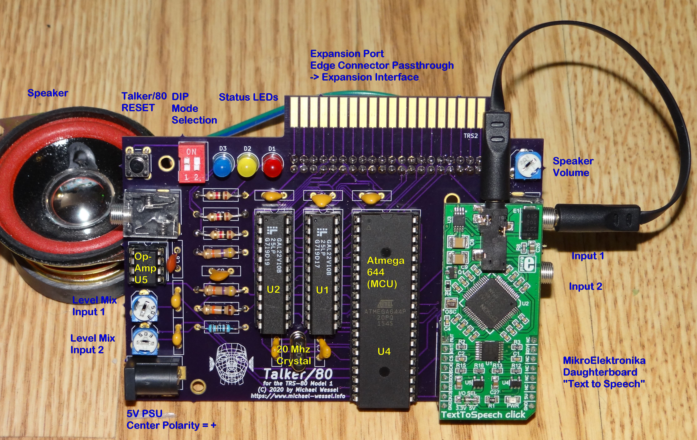
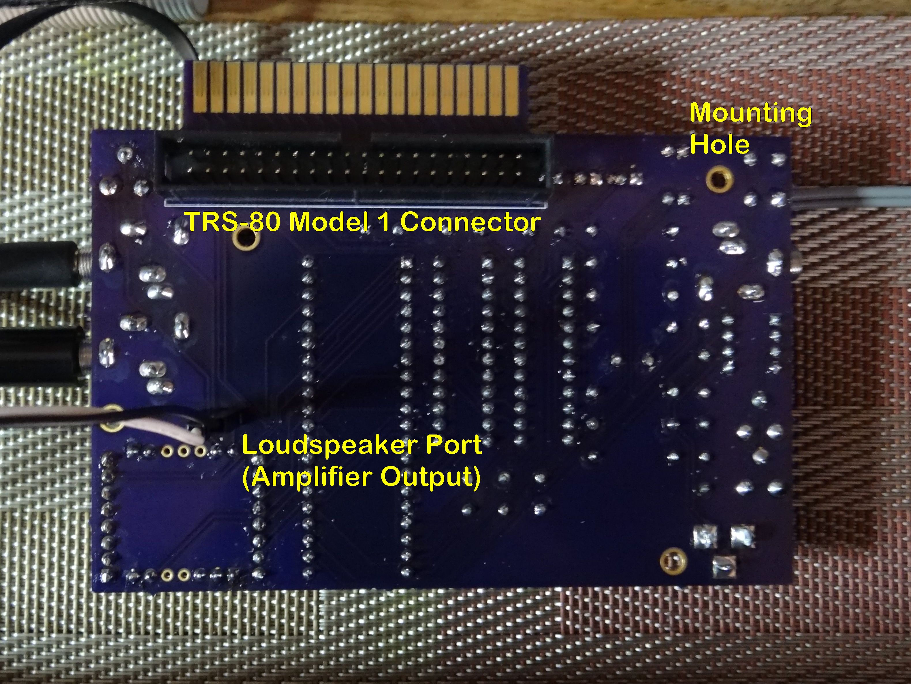

Talker/80 gets its power from a standard, voltage stabilized **5V power supply** ("Wall Wart") with **positive center polarity**, **5.5 mm x 2.5mm**.  It connects to the Talker/80 Barrel Jack.  

It is very important that your equipment is powered on in the right order of sequence: 

 1. Make sure everything is powered off. 
 2. Make sure everything is connected correctly (Talker/80 to the Model 1, Expansion Interface (EI) to Talker/80 if present - note that it does not require the Expansion Interface). Alternatively, you can also keep the EI directly connected to the Model 1, and connect Talker/80 to the EI Expansion Port passthrough port (the edge in the left front corner on the left side of the EI). 
 3. Supply power to Talker/80 by plugging in the PSU. You should hear "Talker/80 initialized" and an announcement of the current mode, which depends on the settings of the DIP switches. 
 4. Power on your Floppy Drives, Printer, etc. 
 5. Power on the Expansion Interface. 
 6. Power on the Model 1. 

## TRS-80 Model 3 / 4 Connection & Startup Sequence 

Same as for Model 1, but use the 50pin ribbon cable. The Talker/80
passthrough connector can be connected to the FreHD HD emulator, an
Orchestra-90, or likewise. It is very important that your equipment is
powered on in the right order of sequence. First power on the expansions (Talker/80, FreHD, ...), and then the Model 3 / Model 4. 

## Hardware Description

Talker/80 uses an ATmega 644-20 (U4) clocked at 20 MHz (or 16 MHz) as its microcontroller. The firmware has ~ 45 KBs. The firmware was programmed in C, using the WinAVR / GCC toolchain. At startup, the ATmega loads the Epson firmware image (implementing DECtalk) over SPI into the speech daughterboard. At runtime, SPI is used as well. External interupts are being used to register read and write requests. The address decoding is done by a GAL20V10 (U1), and another GAL20V10 (U2) is acting as a tristate databus latch and also provides status input (bits 6 and 7) to the TRS-80 in all modes other than the TRS Voice Synthesizer emulation mode. U5 is the op-amp.  The programming / firmware of the address decoder GAL U1 used for the Model 3 / 4 version differs from the Model 1 version. All other chips (and their programming) are identical. 

The current mode of Talker/80 is being signaled to the address decoder GAL U2, using 2 bits for the 4 different modes. Depending on the mode, the GAL U2 eiher decodes IO requests (using IN and OUT signals), or video RAM addresses (and signals RD and WR) to implement "video RAM snooping" (a form of memory-based IO) as required for the TRS Voice Synthesizer. The details can be found in the GAL code. This only works on the Model 1, since the Model 3 / 4 doesn't support memory-based IO. 

Applications can read from IO port 11 to find out if Talker/80 is actively speaking. Note that input to Talker/80 is always buffered, so realtime control of the speaking process (e.g., "voice synthesizer sound effects") is not achievable. As usual, the ``EXTIOSEL`` signal is being used on the Model 3 / 4 to signal an IO read request from port 11. 

### Address Decoding in the Epson and DECtalk Modes  

Talker/80 **listens to port 11**. For the text content, 7 bit ASCII is being used. The text-to-speech conversion is performed internally, so no phoneme encoding on the TRS-80 side is  required. Input from IO port 11 is being buffered. The buffer has a size of 256 bytes. A **return  (CR / ASCII code 13)** initiates the text to speech process, and Talker/80 starts to speak (if the buffer had content). While it speaks, bits 6 and 7 of port 11 will be low - use ``inp(11) AND 192`` to check for bits 6 and 7 being set in BASIC. **Note that the status of the other bits will be undefined, especially on the Model 3 / 4.** 

ASCII characters being sent to port 11 which have its 8th bit (Bit 7) set (i.e., bytes > 127) are being interpreted as **control bytes**. Control bytes are used to control the Talker/80, i.e., to change its current mode, to change parameters of the speech (voice, speak rate, volume), etc. The list of control bytes is given below. For example, to reset Talker/80, send 255 to IO port 11 (use ``out 11,255`` in BASIC).    

Speech can be **blocking or non-blocking**. In the blocking mode, the Z80 CPU is suspended by pulling its ``WAIT`` input low. 

### Address Decoding in the VS-100 Mode 

The primary IO port the VS-100 is also port 11. And like in the Epson and DECtalk modes, one can read the status from port 11. Bits 6 and 7 (the byte starts with Bit 0) indicate if it is busy speaking. 

*For the Model 1 version, lazy / partial address decoding is being used,* just like in the original VS-100. Partial address decoding was used to reduce the address decoder complexity and hence chip count and costs. According to information from members of the Vintage Computer Forum, the following IO ports can also be used to address the VS-100  ("it responds if bits 7, 5, 4 and 2 are 0, don't care for others"):

- 0, 1, 2, 3
- 8, 9, 10, **11** 
- 64, 65, 66, 67
- 72, 73, 74, 75

However, since the VS-100 software only seems to address the VS-100 hardware using port 11, and to reduce the possibility of address conflicts with other hardware extensions, the *Model 3 / 4 version of Talker/80 does full address decoding* and consequently **only** listens to port 11. 

Unlike the DECtalk and EPSON modes, text to speech / encoding of text into phonemes has to be performed on the TRS-80 side. SC-01 phonemes are being sent, not ASCII text characters. 

These are the SC-01 phonemes; the VS-100 phonemes are identical: 
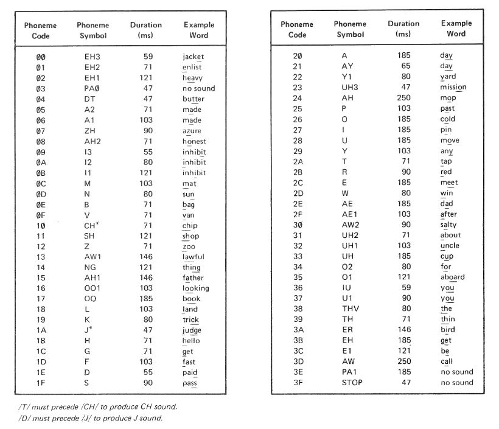

Note that, in order to do the text-to-speech / phoneme mapping, the VS-100 software driver can be used (the programs ``VS48`` and ``VS32``). These drivers allow text-to-speech from BASIC then, so the driver performs the text to phoneme mapping.   

Talker/80 **does not implement the pitch control feature of the SC-01.** The VS-100 uses the last two bits (Bits 6 and 7) of the phoneme bytes to encode / provide pitch control; i.e., each phoneme has in principle 4 different "pronounciations" or "pitches".  These two pitch bits on phonemes are currently being ignored by Talker/80 and hence not supported. To prevent interference with existing VS-100 software, the control bytes understood by Talker/80 in the DECtalk and EPSON modes, are NOT supported in the VS-100 mode. 

Since control bytes are not accepted in this mode, all changes to the default settings need to be made BEFORE entering the VS-100 mode. For example, if a different voice, speech rate or volume is required in the VS-100 mode, then make these changes to the setting from the EPSON or DECtalk mode first, and then enter the VS-100 mode from using the corresponding control byte `&EB`. The changed voice synthesizer settings will then carry over to the VS-100 mode. The mode can only be exited by using the RESET button. 

Here is a picture of the **original VS-100 Voice Synthesizer:** 

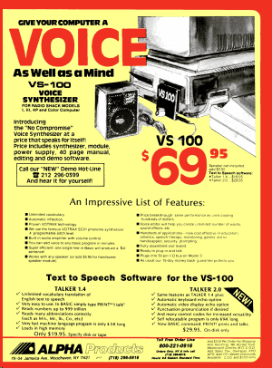
    
### Address Decoding in the TRS Voice Synthesizer Mode

The TRS Voice Synthesizer uses memory-based IO. 
It snoops writes to the video RAM in the address range ``$3FE0 .. $3FFF``. Only the temporal order of writes matters, not the actual address from that range.  Hence, in this mode, any write (WR signal) in that address range will put a byte in the Talker/80 speech buffer.  

A special protocol is being used. Even though the TRS Voice Synthesizer employs the same speech chip as the VS-100, the SC-01, it is not using the SC-01 phonemes directly. Rather, Tandy Radio Shack invented a "printed" phoneme character set for some of the SC-01 phonemes. A special character, the "?" opens and closes the "window" to the Voice Synthesizer. 

The TRS Voice Synthesizer's printed ASCII phonemes for some of the SC-01 phonemes are the following: 

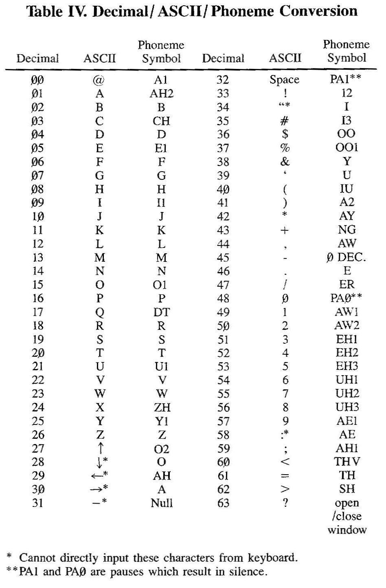

Note that, like in the VS-100, control bytes are not accepted in this mode, as normal "to screen" printing  might otherwise trigger them. If a different voice setting is required in the TRS Voice Synthesizer mode (e.g., a different voice, speech rate or volume), then the setting must be changed from the EPSON or DECtalk mode first, and then the TRS Voice Synthesizer mode be entered using the control bytes `&ED` or `&EC`. The changed voice synthesizer settings will carry over to the new mode, and be active from now on. The TRS Voice Synthesizer mode can only be exited via the RESET button (since no control bytes are accepted). 

*On the Model 3 / 4, the TRS Voice Synthesizer mode can be enabled, but the TRS Voice Synthesizer software will not work properly, due to the impossibility of memory-mapped IO on the Model 3 / 4. However, the TRS Voice Synthesizer emulation can be addressed via IO port 11 and will be working properly if the printed ASCII phonemes are being sent to this port, rather than printed on the screen. Hence, TRS Voice Synthesizer software can be ported by replacing the ``print@"<X>`` (where ``<X>`` is a TRS Voice Synthesizer phoneme) statements with proper ``out 11,asc(<X>)`` statements. Again, this is only necessary for the Model 3 / Model 4 version of Talker/80.* 

Here is a picture of the **original TRS Voice Synthesizer:** 

### Phoneme Tables and Phoneme Mappings  

The VS-100 and TRS Voice Synthesizer Emulations work by mapping SC-01 phonemes to DECtalk "close enough equivalents". This produces understandable speech, but the resulting speech sounds different from the original SC-01. 

Talker/80 implements the following mapping from SC-01 phonemes to DECtalk phonemes: 

    void init_allophones(void) {

      // VOTRAX SC01 -> ARPABET (DECTALK) 

      sc01_map[0x00] = "ih"; // EH3 jackEt
      sc01_len[0x00] = 59;

      sc01_map[0x01] = "eh"; // EH2 Enlist   
      sc01_len[0x01] = 71;

      sc01_map[0x02] = "eh"; // EH1 hEAvy  
      sc01_len[0x02] = 121; 

      sc01_map[0x03] = "_";  // PA0 Pause 
      //sc01_map[0x03] = "";  // PA0 Pause 
      sc01_len[0x03] = 47;

      sc01_map[0x04] = "t"; // DT buTTer 
      sc01_len[0x04] = 47;

      sc01_map[0x05] = "ey"; // A2 mAde 
      sc01_len[0x05] = 71;

      sc01_map[0x06] = "ey"; // A1 mAde 
      sc01_len[0x06] = 103; 

      sc01_map[0x07] = "zh"; // ZH aZure
      sc01_len[0x07] = 90;

      sc01_map[0x08] = "aa"; // AH2 hOnest
      sc01_len[0x08] = 71;

      sc01_map[0x09] = "ah"; // I3 inhibIt 
      sc01_len[0x09] = 55;

      sc01_map[0x0a] = "ih"; // I2 Inhibit 
      sc01_len[0x0a] = 80;

      sc01_map[0x0b] = "ih"; // I1 InhIbit 
      sc01_len[0x0b] = 121; 

      sc01_map[0x0c] = "m"; // M Mat
      sc01_len[0x0c] = 103;

      sc01_map[0x0d] = "n"; // N suN
      sc01_len[0x0d] = 80;

      sc01_map[0x0e] = "b"; // B Bag
      sc01_len[0x0e] = 71;

      sc01_map[0x0f] = "v"; // V Van
      sc01_len[0x0f] = 71;

      sc01_map[0x10] = "ch"; // CH* CHip, T must precede CD to produce CH sound 
      sc01_len[0x10] = 71;

      sc01_map[0x11] = "sh"; // SH SHop
      sc01_len[0x11] = 121;

      sc01_map[0x12] = "z"; // Z Zoo 
      sc01_len[0x12] = 71;

      sc01_map[0x13] = "ao"; // AW1 lAWful   
      sc01_len[0x13] = 146;

      sc01_map[0x14] = "nx"; // NG thiNG   // ng ??
      sc01_len[0x14] = 121;

      sc01_map[0x15] = "aa"; // AH1 FAther 
      sc01_len[0x15] = 146;

      sc01_map[0x16] = "uh"; // OO1 lOOking 
      sc01_len[0x16] = 103;

      sc01_map[0x17] = "uh"; // OO bOOk 
      sc01_len[0x17] = 185;

      sc01_map[0x18] = "ll"; // L Land 
      sc01_len[0x18] = 103;

      sc01_map[0x19] = "k"; // K triCK 
      sc01_len[0x19] = 80;

      sc01_map[0x1a] = "jh"; // J Judge, D must precede J to produce J sound 
      sc01_len[0x1a] = 47;

      sc01_map[0x1b] = "hx"; // H Hello  // hh ??
      sc01_len[0x1b] = 71;

      sc01_map[0x1c] = "g"; // G Get
      sc01_len[0x1c] = 71;

      sc01_map[0x1d] = "f"; // F Fast
      sc01_len[0x1d] = 103;

      sc01_map[0x1e] = "d"; // D paiD
      sc01_len[0x1e] = 55;

      sc01_map[0x1f] = "s"; // S paSS 
      sc01_len[0x1f] = 90;

      sc01_map[0x20] = "ey"; // A dAY 
      sc01_len[0x20] = 185;

      sc01_map[0x21] = "ey"; // AY dAY 
      sc01_len[0x21] = 65;

      sc01_map[0x22] = "yx"; // Y1 Yard // y ? 
      sc01_len[0x22] = 80;

      sc01_map[0x23] = "ah"; // UH3 missIOn
      sc01_len[0x23] = 47;

      sc01_map[0x24] = "aa"; // AH mOp 
      sc01_len[0x24] = 250;

      sc01_map[0x25] = "p"; // P Past 
      sc01_len[0x25] = 103;

      sc01_map[0x26] = "ow"; // O cOld  
      sc01_len[0x26] = 185;

      sc01_map[0x27] = "ih"; // I pIn 
      sc01_len[0x27] = 185;

      sc01_map[0x28] = "uw"; // U mOve  
      sc01_len[0x28] = 185;

      sc01_map[0x29] = "iy"; // Y anY   
      sc01_len[0x29] = 103;

      sc01_map[0x2a] = "t"; // T Tap 
      sc01_len[0x2a] = 71;

      sc01_map[0x2b] = "r"; // R Red
      sc01_len[0x2b] = 90;

      sc01_map[0x2c] = "iy"; // E mEEt 
      sc01_len[0x2c] = 185; 

      sc01_map[0x2d] = "w"; // W Win
      sc01_len[0x2d] = 80;

      sc01_map[0x2e] = "ae"; // AE dAd 
      sc01_len[0x2e] = 185;

      sc01_map[0x2f] = "ae"; // AE1 After 
      sc01_len[0x2f] = 103;

      sc01_map[0x30] = "ao"; // AW2 sAlty 
      sc01_len[0x30] = 90;

      sc01_map[0x31] = "ah"; // UH2 About 
      sc01_len[0x31] = 71;

      sc01_map[0x32] = "ah"; // UH1 Uncle 
      sc01_len[0x32] = 103;

      sc01_map[0x33] = "ah"; // UH3 cUp 
      sc01_len[0x33] = 185;

      sc01_map[0x34] = "ao"; // O2 fOr 
      sc01_len[0x34] = 80;

      sc01_map[0x35] = "ao"; // O1 abOArd 
      sc01_len[0x35] = 121;

      sc01_map[0x36] = "yx"; // IU yOU 
      sc01_len[0x36] = 159;

      sc01_map[0x37] = "uw"; // U1 yOU 
      sc01_len[0x37] = 90;

      sc01_map[0x38] = "dh"; // THV THe 
      sc01_len[0x38] = 80;

      sc01_map[0x39] = "th"; // TH THin
      sc01_len[0x39] = 71;

      sc01_map[0x3a] = "er"; // ER bIrd 
      sc01_len[0x3a] = 146;

      sc01_map[0x3b] = "eh"; // EH gEt 
      sc01_len[0x3b] = 185;

      sc01_map[0x3c] = "iy"; // E1 bE 
      sc01_len[0x3c] = 121;

      sc01_map[0x3d] = "ao"; // AW cAll
      sc01_len[0x3d] = 250;

      //sc01_map[0x3e] = "_"; // PA1 = no sound 
      sc01_map[0x3e] = "_"; // PA1 = no sound 
      sc01_len[0x3e] = 185;

      sc01_map[0x3f] = "_"; // STOP = no sound
      sc01_len[0x3f] = 47;

      // RS TRS80 Voice Synthesizer 

	// codes 00 to 31 
	trs_to_sc01_map['@'] = 0x06; // A1
	trs_to_sc01_map['A'] = 0x08; // A2
	trs_to_sc01_map['B'] = 0x0e; // B 
	trs_to_sc01_map['C'] = 0x10; // CH
	trs_to_sc01_map['D'] = 0x1e; // D
	trs_to_sc01_map['E'] = 0x3c; // E1
	trs_to_sc01_map['F'] = 0x1d; // F
	trs_to_sc01_map['G'] = 0x1c; // G
	trs_to_sc01_map['H'] = 0x1b; // H
	trs_to_sc01_map['I'] = 0x0b; // I1
	trs_to_sc01_map['J'] = 0x1a; // J
	trs_to_sc01_map['K'] = 0x19; // K
	trs_to_sc01_map['L'] = 0x18; // L
	trs_to_sc01_map['M'] = 0x0c; // M
	trs_to_sc01_map['N'] = 0x0d; // N
	trs_to_sc01_map['O'] = 0x35; // O1
	trs_to_sc01_map['P'] = 0x25; // P
	trs_to_sc01_map['Q'] = 0x38; // DH 
	trs_to_sc01_map['R'] = 0x2b; // R
	trs_to_sc01_map['S'] = 0x1f; // S
	trs_to_sc01_map['T'] = 0x2a; // T
	trs_to_sc01_map['U'] = 0x37; // U1
	trs_to_sc01_map['V'] = 0x0f; // V 
	trs_to_sc01_map['W'] = 0x2d; // W 
	trs_to_sc01_map['X'] = 0x07; // ZH
	// trs_to_sc01_map['Y'] = 0x22; // Y1
	trs_to_sc01_map['Y'] = 0x29; // Y - corrected by MW
	trs_to_sc01_map['Z'] = 0x12; // Z 
	trs_to_sc01_map['['] = 0x34; // O2
	trs_to_sc01_map['\\'] = 0x26; // O
	trs_to_sc01_map[']'] = 0x31; // AH
	trs_to_sc01_map['^'] = 0x20; // A 
	trs_to_sc01_map['_'] = 0x03; // NULL (PA0?) 

	// codes 32 to 62 (63 = "?" = OPEN/CLOSE WINDOW) 

	trs_to_sc01_map[' '] = 0x3e; // PA1
	trs_to_sc01_map['!'] = 0x0a; // I2
	trs_to_sc01_map['\"'] = 0x27; // I
	trs_to_sc01_map['#'] = 0x09; // I3
	trs_to_sc01_map['$'] = 0x17; // OO
	trs_to_sc01_map['%'] = 0x16; // OO1
	// trs_to_sc01_map['&'] = 0x29; // Y
	trs_to_sc01_map['&'] = 0x22; // Y1 - corrected by MW
	trs_to_sc01_map['\''] = 0x28; // U
	trs_to_sc01_map['('] = 0x36; // IU
	trs_to_sc01_map[')'] = 0x05; // A2
	trs_to_sc01_map['*'] = 0x21; // AY
	trs_to_sc01_map['+'] = 0x14; // NG
	trs_to_sc01_map[','] = 0x3d; // AW

	// ??? : 
	trs_to_sc01_map['-'] = 0x3f; // 0 DEC. ??? GUESSING STOP 

	trs_to_sc01_map['.'] = 0x2c; // E
	trs_to_sc01_map['/'] = 0x3a; // ER
	trs_to_sc01_map['0'] = 0x03; // PA0 
	trs_to_sc01_map['1'] = 0x13; // AW1
	trs_to_sc01_map['2'] = 0x30; // AW2
	trs_to_sc01_map['3'] = 0x02; // EH1
	trs_to_sc01_map['4'] = 0x01; // EH2
	trs_to_sc01_map['5'] = 0x00; // EH3
	trs_to_sc01_map['6'] = 0x32; // UH1
	trs_to_sc01_map['7'] = 0x31; // UH2
	trs_to_sc01_map['8'] = 0x33; // UH3
	trs_to_sc01_map['9'] = 0x2f; // AE1
	trs_to_sc01_map[':'] = 0x2e; // AE
	trs_to_sc01_map[';'] = 0x15; // AH1
	trs_to_sc01_map['<'] = 0x38; // THV
	trs_to_sc01_map['='] = 0x39; // TH
	trs_to_sc01_map['>'] = 0x11; // SH 

    }

### The Talker/80 Printed Circuit Board (PCB) 

Talker/80 was made with [KiCad EDA v4.0.7](http://kicad-pcb.org/),
and "freeRouting.jar" did the routing.

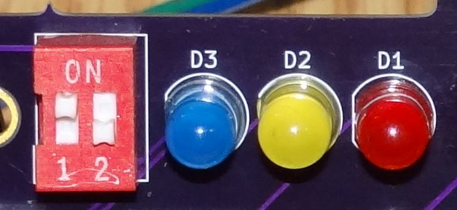

The DIP switches are used for initial boot / startup mode selection (note that the mode can be changed later by sending a control byte); for switch 1, 2 from left to right: 

  - **0n 0n**: EPSON Mode. 
  - **0n Off**: TRS Voice Synthesizer Mode. 
  - **Off On**: VS-100 Voice Synthesizer Mode. 
  - **Off Off**: DECtalk Mode.     

The LEDs have the following meaning - during startup and after mode selection, they briefly indicate the selected mode. The blink in case of errors. In normal operation, they have the following meaning:    

 - **D1:** Incoming data.  
 - **D2:** On if a single phoneme is being uttered, and when the "stop speech" command is being processed. 
 - **D3:** Actively speaking.  

### Schematics 

#### Model 1 Version

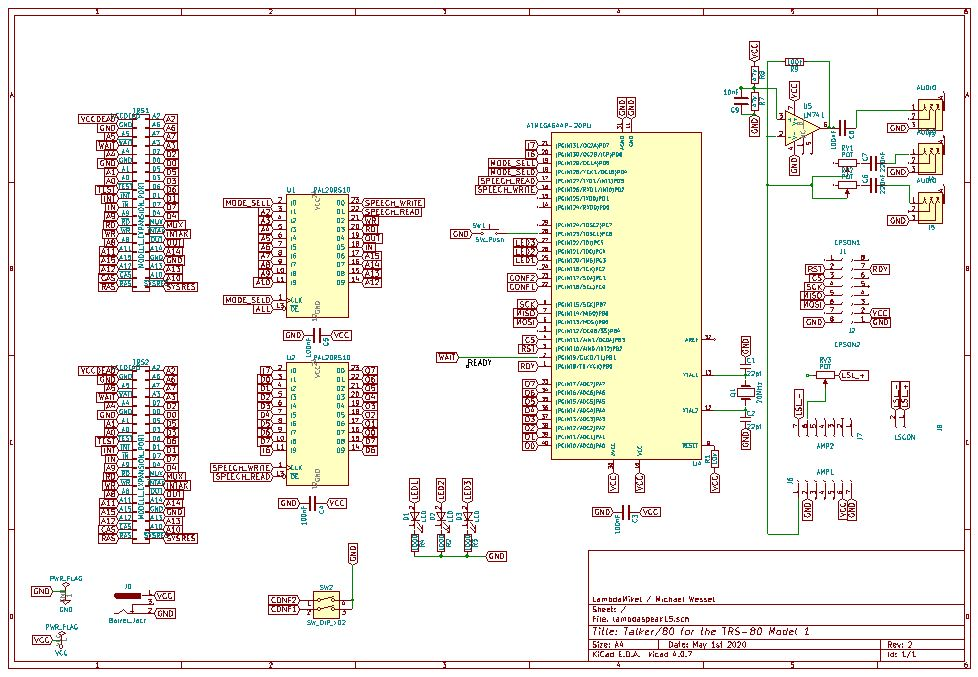 
[Click here for a PDF version of the schematics of the Model 1 version.](schematics/m1/schematics.pdf) 

#### Model 3 / 4 Version
 
[Click here for a PDF version of the schematics of the Model 3 / 4 version.](schematics/m3m4/schematics.pdf) 

### PCB Gerbers 

 
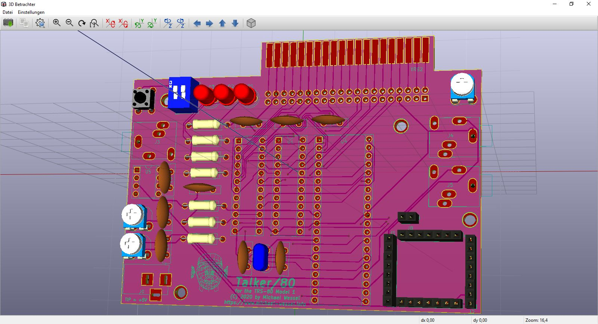

#### Model 1 Version

[Gerbers of the Model 1 version can be found here.](gerbers/m1/talker80-v3.zip) 

A version is also hosted on [OshPark for immediate ordering of PCBs.](https://oshpark.com/shared_projects/RE78tFPR) And [another one on Seeed.](https://www.seeedstudio.com/Talker-80-Voice-Synthesizer-for-the-TRS-80-Model-1-g-1282942)

Bill of Material:

 

#### Model 3 / 4 Version

[Gerbers of the Model 3 / 4 version can be found here.](gerbers/m3m4/talker80-m3m4.zip) 

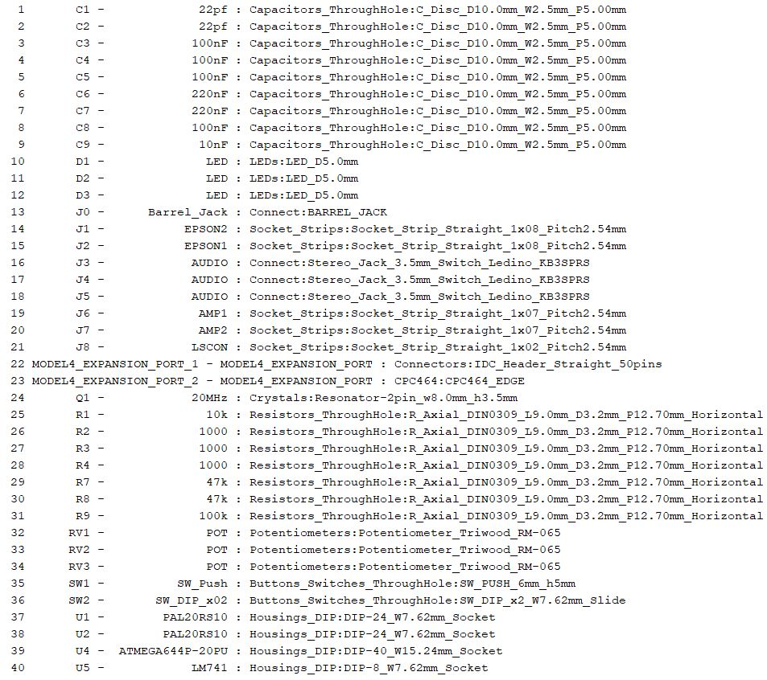 

#### Tipps 
I recommend the use of standard stackable Arduino Headers for J1 and J2 (instead of soldering the daughter board in permanently). For the amplifier board, J6 and J7 are simple pin headers that make the connection to the amplifier board: 

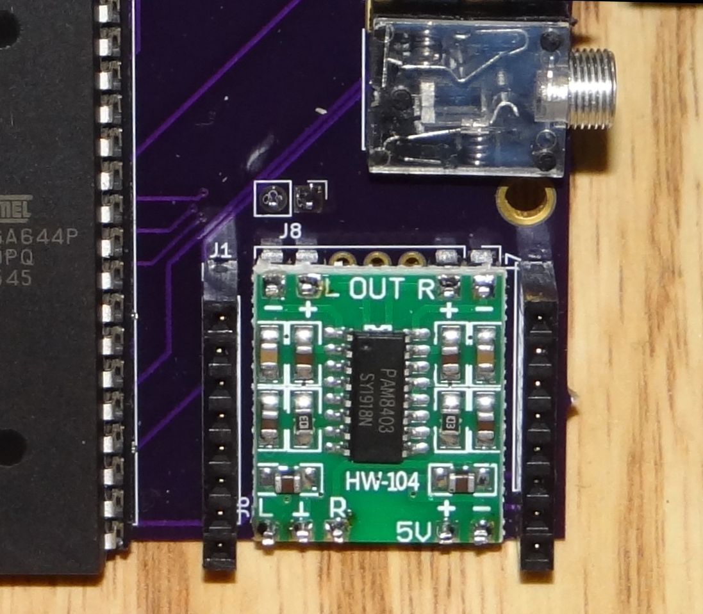 

The form factors in the above BOM are **for illustration only.** Instead of ceramic disc capacitors, I have used ceramic multilayer capacitors mostly. I recommend using DIP sockets for all chips. The values for the pots / trimmers are 503, 503, and 201 (speaker volume). 

## Talker/80 Control Bytes 

These are the control bytes that are ONLY understood in the EPSON and DECtalk modes, in order to prevent interference with screen printing (TRS Voice Synth) and pitch control bit (VS-100). However, you can change the firmware if desired to change this. 

Default settings are shown in **bold**:  

-------------------------------------------------------------------------------------
| Control Byte | Description                                                        |
|--------------|--------------------------------------------------------------------|
| 0xFF / 255   | Reset Talker/80. DIP settings determines mode.                     |
| 0xFE / 254   | Immediately stop speaking.                                         | 
| 0xFD / 253   | Disable Talker/80 until hardware reset.                            |
| 0xFC / 252   | Pull Z80 WAIT states while speaking.                               |
| 0xFB / 251   | **Don't pull Z80 WAIT states while speaking.**                     |
-------------------------------------------------------------------------------------

-------------------------------------------------------------------------------------
| Control Byte | Description                                                        |
|--------------|--------------------------------------------------------------------|
| 0xEF / 239   | **Enable EPSON mode.**                                             |
| 0xEE / 238   | Enable DECtalk mode.                                               |
| 0xED / 237   | Enable TRS Voice Synth mode. "?"-based segmentation of input.      |
| 0xEC / 236   | Enable TRS Voice Synth mode 2. Timer-based segmentation of input.  |
| 0xEB / 235   | VS-100 mode.                                                       | 
| 0xEA / 234   | **Enable audible command confirmations (for control bytes).**      | 
| 0xE9 / 233   | Disable audible command confirmations (for control bytes).         | 
| 0xE8 / 232   | **Enable English.**                                                | 
| 0xE7 / 231   | Enable Castilian Spanish.                                          | 
| 0xE6 / 230   | Enable alternate VS-100 / TRS Voice Synth pronounciation.          | 
| 0xE5 / 229   | **Use normal VS-100 / TRS Voice Synth pronounciation.**            | 
-------------------------------------------------------------------------------------

-------------------------------------------------------------------------------------
| Control Byte | Description                                                        |
|--------------|--------------------------------------------------------------------|
| 0xE4 / 228   | Announce current mode.                                             | 
| 0xE3 / 227   | Speak copyright info.                                              | 
| 0xE2 / 226   | Quote HAL9000.                                                     | 
| 0xE1 / 225   | DECtalk singing demo - "Daisy".                                    | 
| 0xE0 / 224   | Speak current version number.                                      | 
-------------------------------------------------------------------------------------

-------------------------------------------------------------------------------------
| Control Byte | Description                                                        |
|--------------|--------------------------------------------------------------------|
| 0xD0 / 208   | **Use default pitch of voice.**                                    | 
| 0xD1 - 0xDF / 209 - 223   | Use corresponding voice pitch.                        | 
| 0xC0 / 192   | **Use default voice.**                                             | 
| 0xC1 - 0xCF / 193 - 207   | Use corresponding voice. Not all voices are defined.  | 
| 0xB0 / 176   | **Use default volume.**                                            | 
| 0xB1 - 0xBF / 177 - 191   | Use corresponding voice volume.                       | 
| 0xA0 / 160   | **Use default speak rate.**                                        | 
| 0xA1 - 0xAF / 161 - 175   | Use corresponding speak rate.                         | 
-------------------------------------------------------------------------------------

## Talker/80 Programming 

Have a look at the BASIC programs provided on the disk images (see below). 

## The Talker/80 Firmware 

### Model 1 Version

* [GAL22V10 JEDEC Address Decoder JED File](src/gal22v10/m1/Talker80-decoder.jed)
* [GAL22V10 JEDEC Address Decoder WinCupl Source](src/gal22v10/m1/Talker80-decoder.PLD)
* [GAL22V10 JEDEC Databus Buffer JED File](src/gal22v10/m1/Talker80-databus.jed)
* [GAL22V10 JEDEC Databus Buffer WinCupl Source](src/gal22v10/m1/Talker80-databus.PLD)
* [ATmega 644 Firmware HEX File](src/atmega644/talker80-firmware.hex)
* [ATmega 644 Firmware C Source](src/atmega644/talker.c)

### Model 3 / 4 Version

* [GAL22V10 JEDEC Address Decoder JED File](src/gal22v10/m3m4/Talker80-decoder.jed)
* [GAL22V10 JEDEC Address Decoder WinCupl Source](src/gal22v10/m3m4/Talker80-decoder.PLD)
* [GAL22V10 JEDEC Databus Buffer JED File](src/gal22v10/m3m4/Talker80-databus.jed)
* [GAL22V10 JEDEC Databus Buffer WinCupl Source](src/gal22v10/m3m4/Talker80-databus.PLD)
* [ATmega 644 Firmware HEX File](src/atmega644/talker80-firmware.hex)
* [ATmega 644 Firmware C Source](src/atmega644/talker.c)

### Tipps 

The ATmega can be programmed with an EPROM programmer such as the inexpensive USB TL866II which can be found on Ebay and/or Amazon for ~
30 USD. The fuse settings required for Talker/80's 20 MHz (16 MHz) external clock are shown in the following picture:

## Software

### Model 1 Version

There are a number of demo programs.

The main disk is called [`talker80.hfe`](trs80/m1/images/talker80.hfe)
(or [`talker80.jv3`](trs80/m1/images/talker80.jve)). The disk loads with
Model 1 LDOS 3.5.1.

It contains the following: 

----------------------------------------------------------------
| Program      | Description                                   |
|--------------|-----------------------------------------------|
| BASIC        | Disk BASIC to run the programs.               |
| WELCOME.BAS  | Talker/80 Introduction Demo Program.          |
| ENGLISH.BAS  | EPSON MODE English speaking demo.             |
| SPANISH.BAS  | EPSON MODE Spanish speaking demo.             |
| TALKER.BAS   | EPSON / DECtalk text-to-speech demo program.  |
| TALKER2.BAS  | Dito, with status port reading display.       |
| TALKER3.BAS  | Dito, plust STOP command from keyboard.       |
| SENDBYTE.BAS | In EPSON or DECtalk mode, send a control byte.|
| ELIZA80.BAS  | Jeff Shrager's Eliza for Talker/80 EPSON Mode.|
| BUSYTEST.BAS | INP(11) port busy signal read test.           |
| HELLO.BAS    | Simple TRS Voice Synthesizer "HELLO" test.    |
| VOICDEMO.BAS | TRS Voice Synthesizer Demo Program.           |
| VSDEMO.BAS   | VS-100 Voice Synthesizer Demo Program.        |
| VS48.CMD     | VS-100 DOS Driver for 48 KB Machines.         |
| VS32.CMD     | VS-100 DOS Driver for 32 KB Machines.         |
| VS******.CMD | VS-100 Programs. See VS-100 manual.           |
| FROGGER1.CMD | For testing the cassette port sound input.    |
---------------------------------------------------------------- 

### Model 3 / 4 Version

There are a number of demo programs.

The main disk is called
[`talker80.hfe`](trs80/m3m4/images/talker80.hfe) (or
[`talker80.jv3`](trs80/m1/images/talker80.jve)). The disk loads with
Model 3 LDOS 3.5.1. Note that each BASIC (`BAS`) program is also
included as a non-tokenized `TXT` file, to facilitate loading into
another BASIC, e.g., Microsoft BASIC. Microsoft BASIC was the default
TRSDOS / LDOS 6.3.1. Some work might be required to get the programs
to run with Microsoft BASIC (e.g, ELIZA80). Also, the VS-100 software
only seems to work with LDOS 3.5.1 (Model 3 mode). 

So, the DSK contains the following (plus the `TXT` versions of the
BASIC programs):

----------------------------------------------------------------
| Program      | Description                                   |
|--------------|-----------------------------------------------|
| WELCOME.BAS  | Talker/80 Introduction Demo Program.          |
| ENGLISH.BAS  | EPSON MODE English speaking demo.             |
| SPANISH.BAS  | EPSON MODE Spanish speaking demo.             |
| TALKER.BAS   | EPSON / DECtalk text-to-speech demo program.  |
| TALKER2.BAS  | Dito, with status port reading display.       |
| TALKER3.BAS  | Dito, plust STOP command from keyboard.       |
| SENDBYTE.BAS | In EPSON or DECtalk mode, send a control byte.|
| ELIZA80.BAS  | Jeff Shrager's Eliza for Talker/80 EPSON Mode.|
| BUSYTEST.BAS | INP(11) port busy signal read test.           |
| VSDEMO.BAS   | VS-100 Voice Synthesizer Demo Program.        |
| VS48.CMD     | VS-100 DOS Driver for 48 KB Machines.         |
| VS32.CMD     | VS-100 DOS Driver for 32 KB Machines.         |
| VS******.CMD | VS-100 Programs. See VS-100 manual.           |
---------------------------------------------------------------- 

## Media 

### Some Pictures

#### Final Model 1 Breadboard Prototype

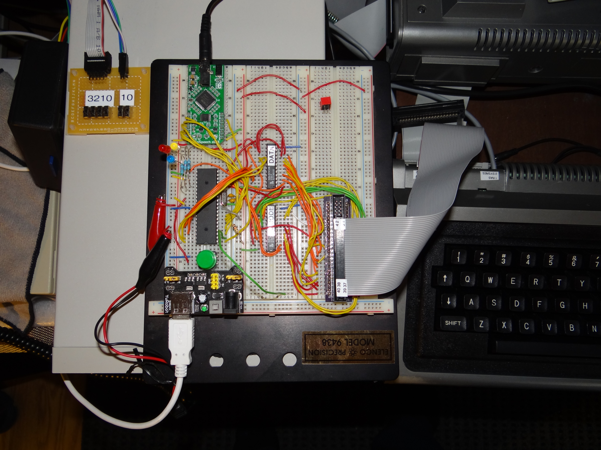

#### First Model 1 PCB Version

#### Final Model 1 PCB Version 

 
 

#### Final Model 3 / 4 PCB Version 

 

### Some YouTube Videos of Talker/80 in Action

#### Model 1 Version

- [First Breadboard Prototype](https://youtu.be/NUp0_M16cys?list=PLvdXKcHrGqhcJzzogLMI-J4Or-ap6UVSY)
- [First PCB Version](https://youtu.be/BFiDv-7CvXA?list=PLvdXKcHrGqhcJzzogLMI-J4Or-ap6UVSY) 
- [Towards the TRS Voice Synthesizer Emulation](https://youtu.be/rNow4joSyGI?list=PLvdXKcHrGqhcJzzogLMI-J4Or-ap6UVSY) 
- [VS-100 Emulation and More Complete Demo of Features ](https://youtu.be/aMnv22EwFEc?list=PLvdXKcHrGqhcJzzogLMI-J4Or-ap6UVSY) 
- ["Talking Eliza" with Talker/80](https://youtu.be/Vv27CSFUAi0?list=PLvdXKcHrGqhcJzzogLMI-J4Or-ap6UVSY)
- [Demonstration of Talker/80 BASIC DEMO Programs](https://youtu.be/ctfGo_UebRY?list=PLvdXKcHrGqhcJzzogLMI-J4Or-ap6UVSY)

#### Model 3 / 4 Version

- [Talker/80 for the Model 3 / 4 - First Test](https://youtu.be/Hmwf4SrK6TY?list=PLvdXKcHrGqhcJzzogLMI-J4Or-ap6UVSY) 
- [Talker/80 for the Model 3 / 4 - VS-100 Demo](https://youtu.be/CJTMGtvuIlQ?list=PLvdXKcHrGqhcJzzogLMI-J4Or-ap6UVSY) 

## Maker Support 

The Gerbers and Firmware and all specs (BOM, ...) are all open source and in principle you can build one yourself. However, if you require certain parts or a pre-programmed GALs, the ATmega, or even a fully assembled Talker/80, please contact me. 

## Acknowledgements

Thanks to [Teodor Costachioiuo](https://electronza.com/about-me/) for
the [Talking Clock Tutorial with the Mikroelektronika Text to Speech
Clock Board](https://electronza.com/wp-content/uploads/2017/09/talking_clock-1.zip);
I have rewritten this (Arduino) code and ported it to WinAVR.

Elliot Wiliams for his book "Make: AVR Programming" and [corresponding sources /AVR Programming Libraries.](https://github.com/hexagon5un/AVR-Programming).

Special thanks to member of the "Vintage Computer Forum" (especially to "Joe Zwerko"!) for providing crucial info, such as the phoneme tables for the Votrax SC-01 and the TRS Voice Synthesizer. 

## Disclaimer 

Use at your own risk. I am not responsible for any potential damage you might cause to your TRS-80, other machinery, or yourself, in the process of assembling and using this piece of hardware.

**Enjoy!** 

